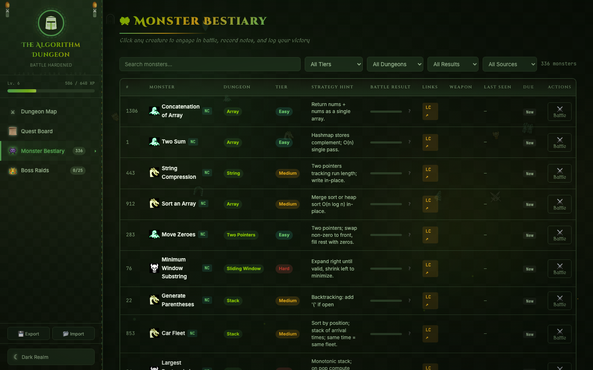
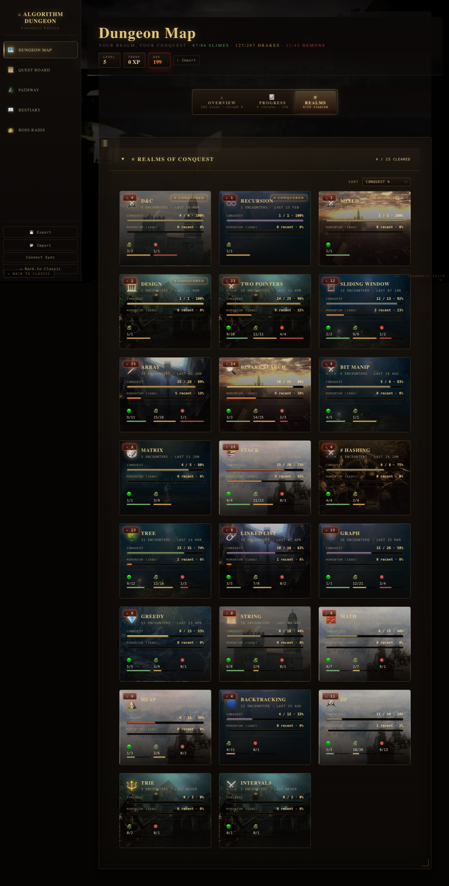
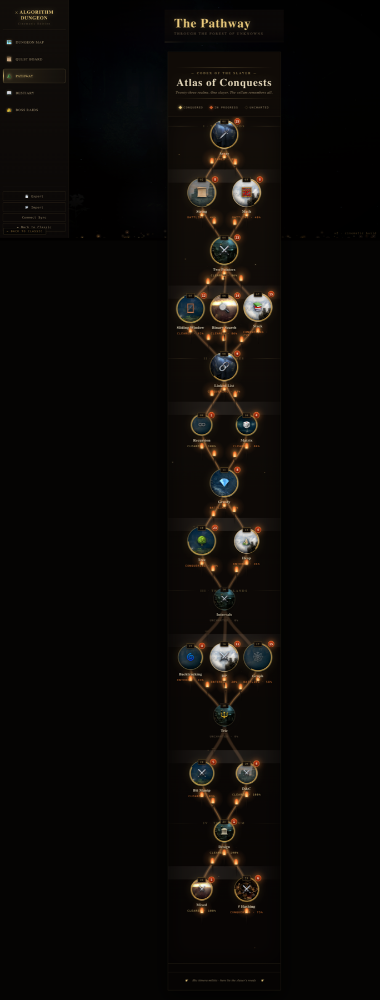
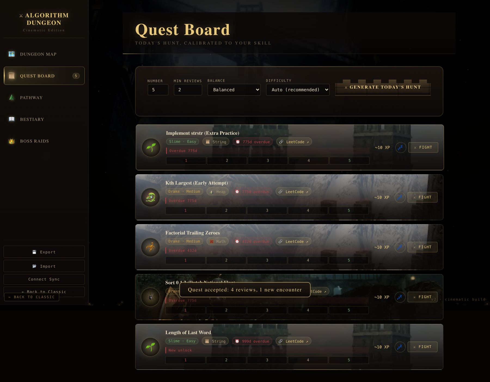

# Leetcode_interesting_repo

A personal collection of LeetCode solutions, paired with two gamified web trackers that turn the practice into an RPG adventure.

## Contents

- **`/` (root)** — Solutions to ~336 LeetCode problems in Python and C++, organized one file per problem.
- **`DSA_Dojo.html`** — Local copy of the V1 tracker (forest theme, single-file HTML). Mirrored from [DSA_Dojo_legacy](https://github.com/heyiamhemant/DSA_Dojo_legacy).
- **`screenshots/`** — Preview captures from V1 and V2.

## Trackers (separate repos)

| Version | Repo | Live Site | Theme |
|---|---|---|---|
| **V2 (current)** | [github.com/heyiamhemant/DSA_Dojo](https://github.com/heyiamhemant/DSA_Dojo) | [heyiamhemant.github.io/DSA_Dojo/](https://heyiamhemant.github.io/DSA_Dojo/) | Cinematic Dark Souls |
| **V1 (legacy)** | [github.com/heyiamhemant/DSA_Dojo_legacy](https://github.com/heyiamhemant/DSA_Dojo_legacy) | [heyiamhemant.github.io/DSA_Dojo_legacy/](https://heyiamhemant.github.io/DSA_Dojo_legacy/) | Forest |

V2 features a cinematic rebuild with parallax pathway, animated fireflies, collapsible bento dashboard, Slime/Drake/Demon tier nomenclature, full Safari/mobile support, and per-topic Dark Souls scene art. V1 is the original forest-themed single-file build, kept around for posterity.

## Preview (V1 — Forest)

| Dashboard | Quest Board |
|:-:|:-:|
|  |  |

| Bestiary | Dungeon Pathway |
|:-:|:-:|
|  |  |

## Preview (V2 — Dark Souls)

| Title Screen | Dashboard |
|:-:|:-:|
|  |  |

| Realms of Conquest | Dungeon Pathway |
|:-:|:-:|
|  |  |

| Quest Board | Bestiary |
|:-:|:-:|
|  |  |

| Boss Raids |
|:-:|
|  |

## Run Locally

No build step. Everything is static.

```bash
# Solutions live here.
git clone https://github.com/heyiamhemant/Leetcode_interesting_repo.git
cd Leetcode_interesting_repo

# Open the included V1 tracker (or pull from the V1 repo for the canonical copy).
open DSA_Dojo.html

# For V2 (cinematic), use its own repo since it has assets/ and dojo-core.js.
git clone https://github.com/heyiamhemant/DSA_Dojo.git
open DSA_Dojo/index.html
```

## Credits

Dark Souls scene imagery (used in V2) is fan-curated from the Dark Souls Fandom Wiki for personal/educational use only.
